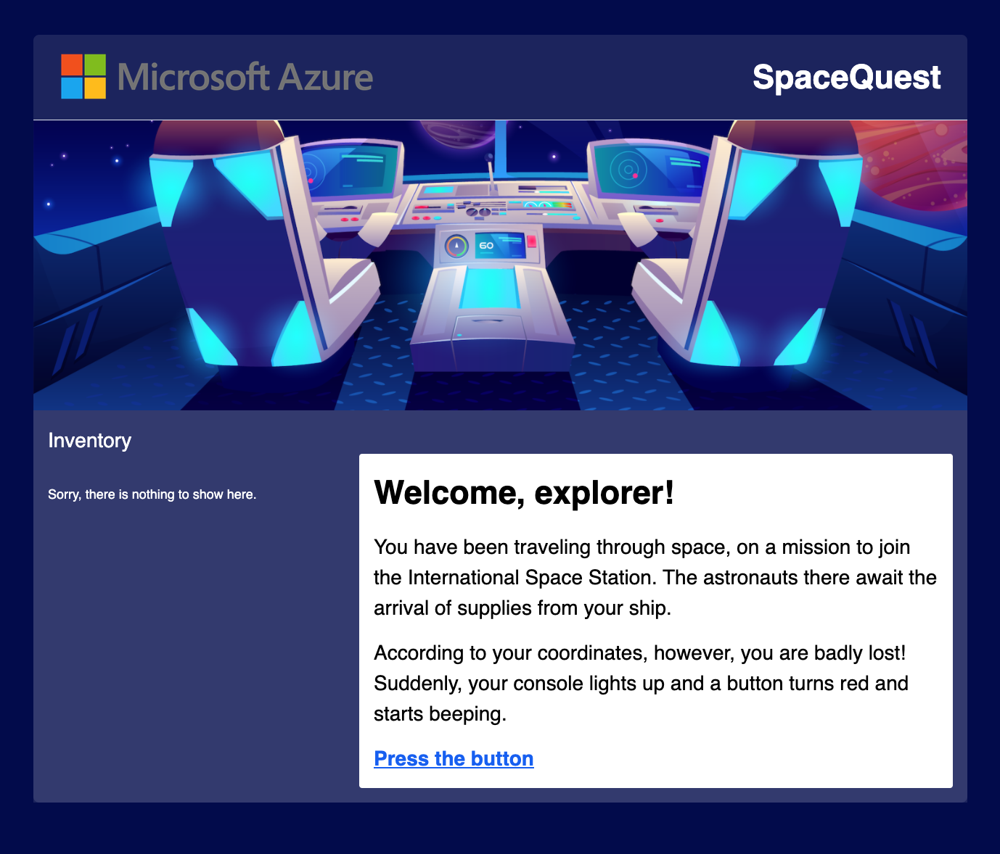

# 🚀👽✨ Welcome to your new game! 🚀👽✨

## Description



## History of the Project

Azure Advocates have been creating fun text-based games to encourage students of all ages to learn about Microsoft Learn and Docs. The [Azure Mystery Mansion](https://aka.ms/mysterymansion), and the ongoing [Azure Maya Mystery](https://aka.ms/AzureMayaMystery) all fit into this prototype. Em Lazer-Walker and Jen Looper worked as primary developers on the Mystery Mansion, and Jen Looper and Chris Noring were primary developers on the Maya Mystery. This game engine is a prototype that we hope will be forked and reused by all kinds of people who want to create fun text-based games and learn about web programming as well.

## Architecture

This site is a hybrid of a Vue.js Single Page Web App and a VuePress static site. Most written content is written using VuePress's markdown architecture, and the game elements are build as standard Vue.js app elements. The game is contained in the `/app` folder. The site is deployed on [Azure Static Web Apps](https://azure.microsoft.com/services/app-service/static/?WT.mc_id=gameengine-github-jelooper#overview).

Create new pages of your Mystery Adventure game by adding Markdown files in the `app/game/.vuepress` folder. Currently there are three narrative files (README.md, 1.md and 2.md). You can make your game trickier by renaming these files with unique words or a unique id, to that people won't be able to guess the next step by its url without solving a challenge. If you do, don't forget to change the Page url where the user clicks to get to the next page.

Create elements of the game in `app/game/.vuepress/theme/utils/items.json`. Here you can include items to pick up and results of picking up the items. Let your creativity guide you!

## Running your site locally

To run this app, you need to fork it and make sure you have your development environment set up for Vue and VuePress development. First, ensure that you have [node.js and npm](https://docs.npmjs.com/downloading-and-installing-node-js-and-npm) or [node and yarn](https://classic.yarnpkg.com/en/docs/install/#mac-stable) installed.

For VuePress, install the [package globally](https://vuepress.vuejs.org) using yarn or npm:

```
yarn global add vuepress
or
npm install -g vuepress
```

Follow the instructions [here](https://vuepress.vuejs.org/guide/getting-started.html) to get set up. When your local system is ready, you can start running this web site for local development.

To run the site locally, use the command:

`npm run dev`.

Build the site locally:

`npm run build`.

## Deploying your site

You can deploy this site to your own Static Web App:

[](https://portal.azure.com/?feature.customportal=false&WT.mc_id=gameengine-github-jelooper#create/Microsoft.StaticApp)